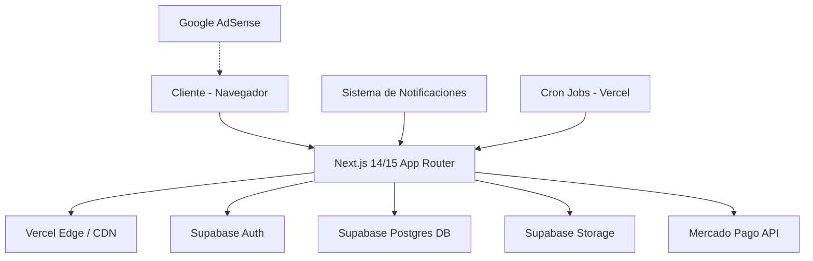
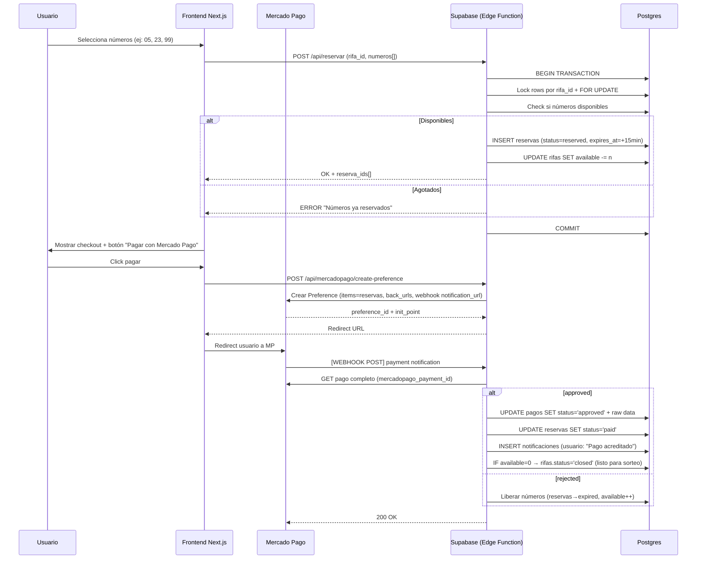

# Arquitectura Técnica — RifasCenter

> Versión 1.0 | Beta Inicial

---

## 1. Visión General

**RifasCenter** es una plataforma SaaS serverless para la creación y participación en rifas/sorteos digitales. El valor diferencial es la combinación de sorteos comerciales (premios) + sorteos solidarios (recaudación de fondos).

- **Usuarios**: Cualquier persona puede participar y/o crear rifas (roles dinámicos por rifa).
- **Límite por rifa**: 10-100 números (00-99), configurable por el creador.
- **Monetización**: Anuncios no intrusivos (banner + native) + futuras comisiones por transacción.
- **Beta**: Pago real vía Mercado Pago desde el día 1.

---

## 2. Stack Tecnológico Completo



| Capa | Tecnología | Justificación |
|------|-----------|---------------|
| **Frontend** | Next.js 15 (App Router) + TypeScript + Tailwind CSS 4.0 | SSR/ISR para SEO de rifas, Edge Runtime, componentes server/client nativos. |
| **UI Kit** | shadcn/ui + Lucide Icons | Componentes accesibles, personalizables, cero runtime overhead. |
| **Estado** | React Server Components + Zustand (client-side only) | Evita over-engineering con Redux; Zustand para estado global pequeño (carrito, UI). |
| **Backend** | Supabase Postgres + Edge Functions (Deno) | Serverless, Auth integrado, Row Level Security nativo. Free tier generoso. |
| **Auth** | Supabase Auth (Email + Google OAuth) | JWT + RLS, sesiones seguras, social login sin costo. |
| **Pagos** | Mercado Pago SDK + Webhooks | Pasarela líder en LATAM, soporta múltiples países, split de pagos futuro. |
| **Storage** | Supabase Storage S3 compatible | Imágenes de premios, avatares, evidencia de sorteos. |
| **Anuncios** | Google AdSense (en espera de aprobación) + Placeholders locales | Banners sticky y native ads intercalados en listings. |
| **Cron** | Vercel Cron Jobs | Expirar reservas, cerrar rifas vencidas, notificaciones programadas. |
| **Deploy** | Vercel (frontend) + Supabase Cloud (BD/Storage/Auth) | Zero-config deploy desde GitHub, previews por PR. |
| **Monitoring** | Vercel Analytics + Supabase Logs + Sentry (opcional beta) | Track de errores y performance sin costo inicial. |

---

## 3. Modelo de Datos (Supabase Postgres)

```mermaid
erDiagram
    USERS ||--o{ RIFAS : crea
    USERS ||--o{ RESERVAS : hace
    RIFAS ||--o{ RESERVAS : tiene
    RIFAS ||--o{ PAGOS : referencia
    RESERVAS ||--o{ PAGOS : paga
    RIFAS ||--o| GANADORES : tiene
    USERS ||--o| GANADORES : gana

    USERS {
        uuid id PK
        string email UK
        string full_name
        string avatar_url
        string phone
        string country
        timestamp created_at
        boolean is_verified
    }

    RIFAS {
        uuid id PK
        uuid creator_id FK
        string title
        text description
        string prize_name
        string prize_image_url
        decimal prize_value
        boolean is_solidarity
        string cause_name
        string cause_description
        decimal number_price
        int total_numbers
        int available_numbers
        string status "draft|active|closed|finished"
        timestamp ends_at
        timestamp draw_date
        json banner_ad_config
        timestamp created_at
    }

    RESERVAS {
        uuid id PK
        uuid rifa_id FK
        uuid user_id FK
        string number "00-99"
        string status "reserved|paid|cancelled|expired"
        timestamp expires_at
        timestamp created_at
    }

    PAGOS {
        uuid id PK
        uuid reserva_id FK
        uuid rifa_id FK
        uuid user_id FK
        string mercado_pago_payment_id UK
        string status "pending|approved|rejected|refunded"
        decimal amount
        string payment_method
        json mercado_pago_raw
        timestamp paid_at
        timestamp created_at
    }

    GANADORES {
        uuid id PK
        uuid rifa_id FK UK
        uuid user_id FK
        string winning_number
        json draw_proof "hash, screenshot, testigo"
        timestamp drawn_at
    }
```

### Índices y Constraints Clave
- `RESERVAS(rifa_id, number)` — **UNIQUE parcial** donde status IN ('reserved','paid') → evita doble venta del mismo número.
- `RIFAS` check constraint: `total_numbers BETWEEN 10 AND 100` y `available_numbers <= total_numbers`.
- `RESERVAS.expires_at` = `NOW() + INTERVAL '15 minutes'` (reserva temporal mientras paga).

---

## 4. Row Level Security (RLS) — Supabase

> El pilar de seguridad: cada usuario solo VE y MODIFICA lo que le corresponde.

```sql
-- RIFAS:
-- SELECT: Todos pueden ver rifas ACTIVAS + creador ve todo lo suyo
CREATE POLICY rifas_select ON rifas FOR SELECT USING (
    status = 'active' OR creator_id = auth.uid()
);
-- INSERT/UPDATE/DELETE: Solo el creador, y SOLO si status = 'draft'
CREATE POLICY rifas_cud ON rifas FOR ALL USING (
    creator_id = auth.uid() AND status = 'draft'
);

-- RESERVAS: Usuario ve/mantiene SOLO sus propias reservas
CREATE POLICY reservas_user ON reservas FOR ALL USING (
    user_id = auth.uid()
);
-- + Policy para stats públicas (count de números vendidos por rifa)

-- PAGOS: Solo el usuario dueño del pago puede consultarlo
CREATE POLICY pagos_owner ON pagos FOR SELECT USING (
    user_id = auth.uid()
);
```

---

## 5. Flujos Clave (Beta)

### 5.1 Crear una Rifa (Rol Dinámico Creador)
```
1. Usuario logueado → "Crear rifa"
2. Formulario:
   ├── Título, descripción
   ├── Premio (nombre, valor, foto)
   ├── ¿Es solidaria? → causa, objetivo de fondos
   ├── Precio por número
   ├── Total números (10-100) → sistema muestra 00-XX
   ├── Fecha límite de venta / fecha de sorteo
3. Preview + Confirmar → rifa.status = 'active'
4. ↪ Validación server-side: creator_id = auth.uid()
5. Disponible en el listing público
```

### 5.2 Compra de Números + Mercado Pago (Webhook)


### 5.3 Anuncios — Estrategia Beta
- **Ad Slot 1**: Sticky banner inferior (728x90) en todas las páginas (excepto checkout).
- **Ad Slot 2**: Native card intercalada cada 6 ítems en el listing de rifas (`/rifas`).
- **Ad Slot 3**: Banner lateral (300x250) en detalle de rifa (desktop only).
- **Durante beta**: Se usan placeholders SVG si AdSense no está aprobado aún, con texto "Espacio publicitario — RifasCenter Beta".

---

## 6. Sistema de Notificaciones
- **Channel inicial**: Email (Supabase Email Templates + Resend opcional).
- **Eventos**:
  - Reserva confirmada + pago aprobado/rechazado.
  - Eres el ganador (con PDF de constancia).
  - Tu rifa vendió el 50% / vendió el 100%.
  - Recordatorio 24h antes de sorteo.
- **In-app**: Panel "Mis Notificaciones" con Toast UI.

---

## 7. Cron Jobs (Vercel)
```
┌─ Cada 5 min: expirar reservas vencidas (status='reserved' AND expires_at < NOW)
│   → Liberar números, decrementar available, notify usuario.
│
├─ Diario 00:00: cerrar rifas donde ends_at < NOW y status='active'
│
└─ Cada 1h: verify pagos pendientes (Mercado Pago GET) por si falló webhook
```

---

## 8. Arquitectura de Carpetas (Next.js 15 App Router)

```
rifascenter/
├── app/
│   ├── (marketing)/          # Landing, about, pricing (ISR)
│   │   ├── page.tsx
│   │   └── layout.tsx
│   ├── (app)/                # Zona privada (middleware -> auth)
│   │   ├── layout.tsx
│   │   ├── rifas/
│   │   │   ├── page.tsx              # Listado / búsqueda (SSR)
│   │   │   ├── crear/page.tsx        # Formulario creador
│   │   │   └── [id]/page.tsx         # Detalle + compra números
│   │   ├── mis-rifas/
│   │   │   ├── creadas/page.tsx      # Mis rifas creadas
│   │   │   └── participando/page.tsx # Rifas en que participo
│   │   ├── perfil/page.tsx
│   │   └── checkout/[reservaId]/page.tsx
│   ├── api/
│   │   ├── auth/[...nextauth]/route.ts  # Callback Supabase
│   │   ├── reservar/route.ts
│   │   ├── mercadopago/
│   │   │   ├── create-preference/route.ts
│   │   │   └── webhook/route.ts         # PUBLICA, valida signature MP
│   │   └── cron/
│   │       └── limpiar-reservas/route.ts
│   ├── globals.css
│   └── layout.tsx
├── components/
│   ├── ui/              # shadcn components (botón, card, input, dialog)
│   ├── rifas/           # RifaCard, NumberGrid, CreatorForm, PaymentStatus
│   ├── ads/             # AdBanner, AdNativeCard
│   └── layout/          # Navbar, Footer, SidebarProfile
├── lib/
│   ├── supabase/        # server.ts, client.ts, middleware.ts
│   ├── mercadopago.ts   # SDK init + helpers
│   ├── utils.ts         # format currency, format number (00-99)
│   └── types.ts         # interfaces TS (Rifa, Reserva, Pago, User)
├── hooks/
│   ├── use-rifa-numbers.ts  # Lógica selección números
│   └── use-cart.ts          # Números seleccionados actuales
├── supabase/
│   ├── migrations/      # SQL versionado
│   │   ├── 0001_init_schema.sql
│   │   ├── 0002_rls_policies.sql
│   │   └── 0003_mercado_pago.sql
│   ├── seed.sql         # Datos demo (rifas + users test)
│   └── config.toml
├── public/
│   ├── ads/             # Placeholders anuncios SVG
│   └── images/
├── package.json
├── next.config.mjs
├── tailwind.config.ts
└── vercel.json          # + Cron config
```

---

## 9. Variables de Entorno `.env.local`

```env
# NEXT.JS
NEXT_PUBLIC_SITE_URL=http://localhost:3000
NEXT_PUBLIC_APP_NAME=RifasCenter

# SUPABASE
NEXT_PUBLIC_SUPABASE_URL=
NEXT_PUBLIC_SUPABASE_ANON_KEY=
SUPABASE_SERVICE_ROLE_KEY=          # Edge functions / webhooks / admin

# MERCADO PAGO
MERCADO_PAGO_ACCESS_TOKEN=         # TEST-xxx en beta
NEXT_PUBLIC_MERCADO_PAGO_PUBLIC_KEY=
MERCADO_PAGO_WEBHOOK_SECRET=       # Firma para validar webhooks

# ADSENSE (opcional beta)
NEXT_PUBLIC_ADSENSE_PUBLISHER_ID=  # ca-pub-XXX
NEXT_PUBLIC_ADSENSE_SLOT_BANNER=
NEXT_PUBLIC_ADSENSE_SLOT_NATIVE=
```

---

## 10. Roadmap Técnico (Suggerido para la Beta)

| Fase | Duración | Entregable |
|------|----------|-----------|
| **0 — Setup** | 1 día | Init Next.js 15 + Tailwind + shadcn/ui + Supabase project + Git |
| **1 — Core** | 3 días | Schema DB + RLS + Auth (email+google) + Layout base |
| **2 — Rifas** | 4 días | CRUD creador + List público + Detalle + Buscador/filtrado |
| **3 — Números** | 3 días | Grid números interactivo + Reserva transaccional + Carrito |
| **4 — Pagos** | 4 días | Mercado Pago Checkout Pro + Webhook + Estados + Receipt |
| **5 — Panel** | 2 días | Mis rifas creadas + Mis participaciones + Perfil |
| **6 — Ads + UI** | 2 días | Ad slots placeholders + Responsive full test + Accesibilidad |
| **7 — Deploy** | 1 día | Vercel + Supabase + Config domininio + SSL + Smoke test |
| **Total** | **~20 días hábiles** | Beta operativa con pago real |

---

## 11. Escalabilidad Futura (Post-Beta)

- **Comisión**: 5-8% sobre cada ticket aprobado (webhook → calcular comisión → facturación).
- **Split solidario**: Enviar % directamente a cuenta bancaria ONG via Open Finance.
- **Multi-pasarela**: Stripe (global) + PIX (Brasil) + Nequi (Colombia).
- **Real-time**: Supabase Realtime channels para "número recién vendido" en vivo.
- **Sorteo verificable**: Algoritmo hash-chain con semilla pública (transparencia).
- **App móvil**: Expo React Native compartiendo componentes UI.
- **Referidos**: Sistema de referidos con descuento en próximas rifas.
