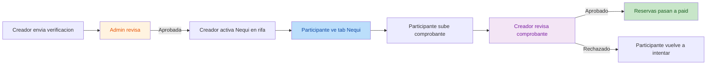
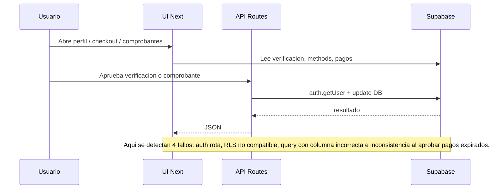

# Auditoria Tecnica Flujo Nequi - 2026-09-11

## Objetivo

Auditar el flujo completo de pago por Nequi implementado en el bloque reciente:

- verificacion del creador
- aprobacion por admin
- activacion de Nequi por rifa
- checkout del participante
- subida de comprobante
- aprobacion del creador

La auditoria se realiza sobre el estado integrado en `develop` con build exitoso y base cloud ya sincronizada.

## Intento del cambio

El objetivo funcional del bloque fue agregar un medio de pago manual simple y escalable:

1. El creador envia su verificacion Nequi.
2. El admin aprueba o rechaza esa verificacion.
3. El creador activa Nequi en una rifa.
4. El participante paga por Nequi y sube comprobante.
5. El creador valida el comprobante.
6. La reserva pasa a pagada.

## Alcance auditado

- Codigo auditado:
  - [page.tsx](file:///c:/Github/Rifas/app/(app)/checkout/[reservaId]/page.tsx)
  - [page.tsx](file:///c:/Github/Rifas/app/(app)/admin/verificaciones-nequi/page.tsx)
  - [page.tsx](file:///c:/Github/Rifas/app/(app)/mis-rifas/comprobantes-nequi/[rifaId]/page.tsx)
  - [page.tsx](file:///c:/Github/Rifas/app/(app)/perfil/page.tsx)
  - [page.tsx](file:///c:/Github/Rifas/app/(app)/rifas/crear/page.tsx)
  - [NequiVerificationForm.tsx](file:///c:/Github/Rifas/components/nequi/NequiVerificationForm.tsx)
  - [PaymentMethodsToggles.tsx](file:///c:/Github/Rifas/components/nequi/PaymentMethodsToggles.tsx)
  - [NequiCheckoutPane.tsx](file:///c:/Github/Rifas/components/nequi/NequiCheckoutPane.tsx)
  - [VoucherReviewList.tsx](file:///c:/Github/Rifas/components/nequi/VoucherReviewList.tsx)
  - [route.ts](file:///c:/Github/Rifas/app/api/admin/nequi-verifications/[id]/review/route.ts)
  - [route.ts](file:///c:/Github/Rifas/app/api/nequi-payments/[id]/review/route.ts)
  - [0011_nequi_lifecycle.sql](file:///c:/Github/Rifas/supabase/migrations/0011_nequi_lifecycle.sql)
  - [server.ts](file:///c:/Github/Rifas/lib/supabase/server.ts)
  - [types.ts](file:///c:/Github/Rifas/lib/types.ts)

- Verificaciones realizadas:
  - revision estatica del diff `3cd3779..343d647`
  - lectura cruzada de schema, RLS, tipos y consumo en UI/API
  - prueba browser del flujo de comprobantes
  - validacion independiente por 2 revisores paralelos

## Resumen Ejecutivo

- Estado general: el flujo Nequi no esta listo para produccion.
- Hallazgos confirmados: 4 bugs reales, 1 de severidad critica y 3 de severidad alta.
- Riesgo principal: hoy el flujo puede quedar bloqueado antes de la aprobacion, o aprobar pagos dejando reservas inconsistentes.
- Conclusion: primero hay que corregir autorizacion de endpoints, lectura RLS en checkout, mismatch de columna en comprobantes y sincronizacion de reservas al aprobar.

## Vista General

### Flujo de negocio esperado

### Flujo tecnico implementado

## Hallazgos

| No. | Severidad | Titulo | Evidencia |
|-----|-----------|--------|-----------|
| 1 | Critica | Los endpoints de aprobacion usan `createServiceClient()` y luego `auth.getUser()`, por lo que no pueden resolver la sesion del usuario real | [server.ts:L49-L77](file:///c:/Github/Rifas/lib/supabase/server.ts#L49-L77), [route.ts:L20-L27](file:///c:/Github/Rifas/app/api/admin/nequi-verifications/[id]/review/route.ts#L20-L27), [route.ts:L20-L27](file:///c:/Github/Rifas/app/api/nequi-payments/[id]/review/route.ts#L20-L27) |
| 2 | Alta | La pagina de comprobantes consulta `reference`, pero el schema, el insert y el tipo usan `voucher_reference` | [page.tsx:L79-L85](file:///c:/Github/Rifas/app/(app)/mis-rifas/comprobantes-nequi/[rifaId]/page.tsx#L79-L85), [0011_nequi_lifecycle.sql:L76-L93](file:///c:/Github/Rifas/supabase/migrations/0011_nequi_lifecycle.sql#L76-L93), [NequiCheckoutPane.tsx:L95-L106](file:///c:/Github/Rifas/components/nequi/NequiCheckoutPane.tsx#L95-L106), [types.ts:L80-L89](file:///c:/Github/Rifas/lib/types.ts#L80-L89) |
| 3 | Alta | El checkout del participante intenta leer `user_nequi_verifications`, pero esa tabla no es publica por RLS; la tab Nequi puede quedar oculta aunque el creador este aprobado | [page.tsx:L266-L304](file:///c:/Github/Rifas/app/(app)/checkout/[reservaId]/page.tsx#L266-L304), [page.tsx:L708-L715](file:///c:/Github/Rifas/app/(app)/checkout/[reservaId]/page.tsx#L708-L715), [0011_nequi_lifecycle.sql:L116-L123](file:///c:/Github/Rifas/supabase/migrations/0011_nequi_lifecycle.sql#L116-L123), [0011_nequi_lifecycle.sql:L205-L221](file:///c:/Github/Rifas/supabase/migrations/0011_nequi_lifecycle.sql#L205-L221) |
| 4 | Alta | La aprobacion del comprobante no usa `reserva_ids` y no contempla reservas `expired`; puede dejar `nequi_payment=approved` pero reservas sin pagar | [route.ts:L40-L58](file:///c:/Github/Rifas/app/api/nequi-payments/[id]/review/route.ts#L40-L58), [route.ts:L86-L142](file:///c:/Github/Rifas/app/api/nequi-payments/[id]/review/route.ts#L86-L142) |

## Detalle de Bugs

### 1. Endpoints de aprobacion sin sesion real

**Severidad:** Critica

**Descripcion**

Ambas rutas de review usan [createServiceClient()](file:///c:/Github/Rifas/lib/supabase/server.ts#L49-L77), y ese cliente se inicializa sin cookies:

- `getAll() => []`
- `persistSession: false`
- `autoRefreshToken: false`

Luego intentan identificar al usuario con `sb.auth.getUser()`.

**Problema**

Eso rompe el control de acceso porque la ruta no esta autenticando al usuario que hizo la request, sino a un cliente service-role sin sesion de navegador.

**Impacto**

- el admin no puede aprobar verificaciones de manera confiable
- el creador no puede aprobar comprobantes de manera confiable
- el flujo puede responder `401 no auth` aunque el usuario este logueado en la app

**Refactor recomendado**

- leer primero la sesion con [createClient()](file:///c:/Github/Rifas/lib/supabase/server.ts#L12-L47) usando cookies del request
- una vez obtenido `user.id`, hacer las operaciones sensibles con `createServiceClient()`
- separar claramente:
  - autenticacion del request
  - escritura privilegiada

### 2. Mismatch `reference` vs `voucher_reference`

**Severidad:** Alta

**Descripcion**

La tabla `nequi_payments` define `voucher_reference`:

- [0011_nequi_lifecycle.sql:L76-L93](file:///c:/Github/Rifas/supabase/migrations/0011_nequi_lifecycle.sql#L76-L93)

El formulario inserta `voucher_reference`:

- [NequiCheckoutPane.tsx:L95-L106](file:///c:/Github/Rifas/components/nequi/NequiCheckoutPane.tsx#L95-L106)

El tipo TS tambien usa `voucher_reference`:

- [types.ts:L80-L89](file:///c:/Github/Rifas/lib/types.ts#L80-L89)

Pero la pagina de comprobantes consulta `reference`:

- [page.tsx:L79-L85](file:///c:/Github/Rifas/app/(app)/mis-rifas/comprobantes-nequi/[rifaId]/page.tsx#L79-L85)

**Problema**

La consulta queda desalineada contra el schema real.

**Evidencia de ejecucion**

En la prueba de navegador el listado de comprobantes cargaba vacio y aparecio error SQL:

- `column nequi_payments.reference does not exist`

**Impacto**

- el creador puede ver la pantalla, pero no listar comprobantes reales
- la UI queda falsamente vacia
- bloquea la validacion manual del flujo Nequi

**Refactor recomendado**

- reemplazar `reference` por `voucher_reference` en [page.tsx](file:///c:/Github/Rifas/app/(app)/mis-rifas/comprobantes-nequi/[rifaId]/page.tsx)
- alinear `select`, tipo y renderizado en un solo contrato consistente

### 3. El comprador no puede leer la verificacion del creador por RLS

**Severidad:** Alta

**Descripcion**

El checkout consulta la tabla `user_nequi_verifications` para resolver telefono y QR del creador:

- [page.tsx:L281-L299](file:///c:/Github/Rifas/app/(app)/checkout/[reservaId]/page.tsx#L281-L299)

Pero la policy de esa tabla solo permite `SELECT` a:

- el propio usuario
- un admin

Ver:

- [0011_nequi_lifecycle.sql:L116-L123](file:///c:/Github/Rifas/supabase/migrations/0011_nequi_lifecycle.sql#L116-L123)

**Problema**

El participante no es el creador ni admin, asi que esa lectura puede volver vacia. El codigo entonces ejecuta:

- `acceptNequi = false`

Y la pestaña Nequi queda deshabilitada u oculta.

**Impacto**

- una rifa con Nequi activado puede seguir mostrando solo Mercado Pago al participante
- el creador cree que habilito Nequi, pero el comprador no lo ve

**Refactor recomendado**

- no leer `user_nequi_verifications` directo desde checkout del participante
- usar la vista [user_nequi_status](file:///c:/Github/Rifas/supabase/migrations/0011_nequi_lifecycle.sql#L205-L221) o copiar el dato publico necesario en `rifa_payment_methods`
- si Nequi esta activo, resolver el telefono/QR desde una fuente publicamente accesible y compatible con RLS

### 4. Pago aprobado con reservas aun expiradas

**Severidad:** Alta

**Descripcion**

La ruta de aprobacion carga `reserva_ids`, pero luego no los usa para marcar reservas:

- [route.ts:L40-L58](file:///c:/Github/Rifas/app/api/nequi-payments/[id]/review/route.ts#L40-L58)

Actualiza reservas por:

- `user_id`
- `rifa_id`
- `numbers`
- estados `reserved` o `paid`

Ver:

- [route.ts:L98-L110](file:///c:/Github/Rifas/app/api/nequi-payments/[id]/review/route.ts#L98-L110)

**Problema**

Si el creador aprueba el comprobante despues de que la reserva ya paso a `expired`, esa fila no entra en el update. Aun asi:

- el comprobante queda `approved`
- se inserta fila en `pagos`
- se notifica al usuario como aprobado

**Impacto**

- inconsistencia entre `nequi_payments`, `pagos` y `reservas`
- un pago puede quedar aprobado sin que el numero realmente quede comprado
- riesgo de soporte manual, doble manejo y reclamos

**Refactor recomendado**

- usar `reserva_ids` como fuente principal de actualizacion
- aceptar transicion `expired -> paid` cuando el creador aprueba manualmente un comprobante valido
- envolver update de `nequi_payments`, `reservas`, `pagos` y `notifications` en una sola transaccion SQL o RPC

## Evidencia de Prueba

### Prueba de navegador

Se reprodujo el flujo del creador sobre la pantalla de comprobantes y se confirmo el error de columna inexistente. Resultado visible:

- pagina carga con `0 en total`
- tabs sin datos
- error de Postgres por columna `reference`

### Revision estatica y validacion cruzada

Los 4 hallazgos fueron confirmados por:

- lectura directa del codigo
- cruce con el schema SQL
- cruce con tipos TS
- doble validacion independiente con 2 revisores

## Priorizacion de Fix

### Orden recomendado

1. **Fix auth en endpoints review**
2. **Fix `reference` -> `voucher_reference`**
3. **Fix lectura RLS del checkout para mostrar Nequi**
4. **Fix aprobacion consistente usando `reserva_ids` + soporte a `expired`**

## Recomendacion de Refactor

### Refactor minimo seguro

- mover autenticacion del request a cliente SSR normal
- dejar service role solo para writes privilegiados
- unificar contrato `NequiPayment` entre SQL, tipos, page y componentes
- exponer datos publicos de Nequi del creador en una vista o tabla pensada para checkout
- reemplazar update por `numbers` con update por `reserva_ids`

### Refactor ideal

Crear un RPC o funcion transaccional del lado de Postgres para aprobar comprobantes Nequi:

1. validar creador/admin
2. verificar estado `pending`
3. actualizar `nequi_payments`
4. actualizar `reservas` por `reserva_ids`
5. insertar `pagos`
6. insertar `notifications`
7. devolver resultado consistente

## Conclusiones

- El feature tiene una base correcta de modelado, UI y estructura.
- El bloqueo actual no esta en el diseño visual sino en 4 puntos de integracion entre auth, RLS y persistencia.
- No se recomienda promover este flujo a produccion sin corregir estos hallazgos.
- La correccion deberia ser relativamente acotada porque los bugs estan concentrados en pocos archivos.
