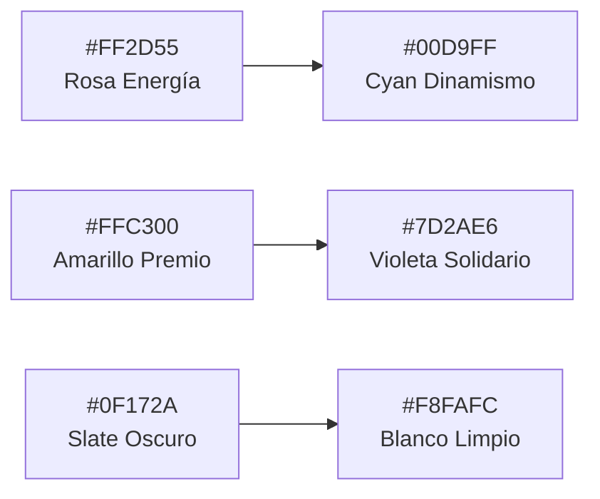

# Manual de Marca — RifasCenter

> Versión 1.0 | Estilo: Joven & Dinámico

---

## 1. Identidad Central

### 1.1 Concepto de Marca
**RifasCenter** es el punto de encuentro entre la emoción de ganar y el poder de apoyar causas que transforman. La personalidad es **energética, transparente, inclusiva y cercana** — habla el mismo idioma de la generación digital pero con credibilidad (no es una app de apuestas, es una plataforma de oportunidades y apoyo comunitario).

### 1.2 Naming
| Elemento | Valor |
|----------|-------|
| **Nombre principal** | RifasCenter |
| **Tagline** | *"Tu número, tu premio, tu causa."* |
| **Variante corta** | RC |
| **Dominio sugerido** | rifascenter.app / rifascenter.com |
| **Hashtag principal** | #RifasCenter |

---

## 2. Paleta de Colores

> Paleta vibrante pero accesible. **No abusar del neon en backgrounds grandes** — reserva para acentos y CTAs.



### 2.1 Paleta Principal
| Rol | Color | Hex | RGB | Uso |
|-----|-------|-----|-----|-----|
| **Primario** | Rosa Energía | `#FF2D55` | `rgb(255,45,85)` | Botones CTA, links, iconografía principal, badge "Activo" |
| **Secundario** | Cyan Dinamismo | `#00D9FF` | `rgb(0,217,255)` | Acento interactivo, estados hover, badge "Nuevo", progresos |
| **Acento 1** | Amarillo Premio | `#FFC300` | `rgb(255,195,0)` | Etiquetas "Premio", ratings, estrellas, highlights solidarios |
| **Acento 2** | Violeta Solidario | `#7D2AE6` | `rgb(125,42,230)` | Tags "Causa Solidaria", gráficos de progreso fondos, ONG badge |

### 2.2 Paleta Neutra
| Tonos | Hex | Uso |
|-------|-----|-----|
| **Slate-900** | `#0F172A` | Títulos, texto principal en modo claro |
| **Slate-700** | `#334155` | Subtítulos y cuerpo texto |
| **Slate-500** | `#64748B` | Texto secundario, labels, metadatos |
| **Slate-300** | `#CBD5E1` | Bordes sutiles, divisores |
| **Slate-100** | `#F1F5F9` | Backgrounds de tarjetas, inputs modo claro |
| **Blanco** | `#FFFFFF` | Background principal modo claro |

### 2.3 Estados Semánticos
| Estado | Color | Hex | Uso |
|--------|-------|-----|-----|
| Éxito | Verde Confirmación | `#10B981` | Pago aprobado, número confirmado, sorteo OK |
| Advertencia | Naranja Cuidado | `#F97316` | Reserva por expirar, rifa por vencer |
| Error | Rojo Problema | `#EF4444` | Pago rechazado, error formulario, agotado |
| Info | Azul Contexto | `#3B82F6` | Tooltips, badges informativos |

### 2.4 Gradientes Oficiales
Usar en hero, banner anuncios internos, fondos de tarjetas destacadas:
```css
/* Gradient Hero */
--gradient-hero: linear-gradient(135deg, #7D2AE6 0%, #FF2D55 50%, #FFC300 100%);

/* Gradient CTA */
--gradient-cta: linear-gradient(90deg, #FF2D55 0%, #7D2AE6 100%);

/* Gradient Premio */
--gradient-premio: linear-gradient(135deg, #FFC300 0%, #FF9500 100%);

/* Gradient Solidario */
--gradient-solidario: linear-gradient(135deg, #00D9FF 0%, #7D2AE6 100%);
```

---

## 3. Tipografía

> Sistema tipográfico moderno, limpio, con alta legibilidad en pantallas pequeñas.

### 3.1 Jerarquía Tipográfica (Tailwind + Google Fonts)
```ts
// tailwind.config.ts
fontFamily: {
  sans: ['Inter', 'system-ui', 'sans-serif'],   // Cuerpo, UI, botones
  display: ['Poppins', 'Inter', 'sans-serif'],  // Títulos, H1-H3, logo wordmark
}
```

| Elemento | Fuente | Peso | Tamaño (px) | Line-height | Caso de uso |
|----------|--------|------|-------------|-------------|-------------|
| **H1 — Display** | Poppins | 800 (ExtraBold) | 48 / 40 / 32 (desktop/tablet/mobile) | 1.1 | Hero principal, títulos de landing |
| **H2 — Sección** | Poppins | 700 (Bold) | 32 / 28 / 24 | 1.2 | Títulos de sección, nombre de rifa destacada |
| **H3 — Sub-sección** | Poppins | 600 (SemiBold) | 22 / 20 / 18 | 1.3 | Título de tarjeta, nombre premio |
| **Cuerpo largo** | Inter | 400 (Regular) | 16 | 1.6 | Descripciones rifa, About, términos |
| **Cuerpo corto/UI** | Inter | 500 (Medium) | 14 | 1.5 | Botones, labels, listados, números de rifa |
| **Metadata/Caption** | Inter | 400 | 12 | 1.4 | Fechas, IDs, tags pequeñas, "Hace 2h" |
| **Número Rifa** | Poppins | 800 | 20 | 1 | Cada número en el grid 00-99 |

### 3.2 Reglas Tipográficas
- **Máximo 65 caracteres por línea** en párrafos para lectura cómoda.
- Nunca usar Poppins en párrafos largos → cansancio visual.
- Números de rifa SIEMPRE en `font-variant-numeric: tabular-nums` para alineación perfecta en el grid.

---

## 4. Sistema de Espaciados y Layout

> Basado en escala **4px base** (multiplos de 4). Coincide con Tailwind default (p-1=4px, p-2=8px, etc.)

### 4.1 Escala de Espaciado
| Token Tailwind | Pixels | Uso sugerido |
|----------------|--------|-------------|
| `space-1` = 4px | 4px | Ícono + texto, checkbox spacing |
| `space-2` = 8px | 8px | Padding interno botón pequeño |
| `space-3` = 12px | 12px | Gap entre ítems compactos |
| `space-4` = 16px | 16px | Gap entre cards, padding tarjeta |
| `space-6` = 24px | 24px | Padding sección pequeña |
| `space-8` = 32px | 32px | Margin entre secciones |
| `space-12` = 48px | 48px | Padding hero, separador grandes bloques |
| `space-20` = 80px | 80px | Separación entre secciones landing |

### 4.2 Breakpoints (Standard Tailwind)
| Breakpoint | Ancho mínimo | Dispositivo |
|-----------|-------------|-------------|
| `sm` | 640px | Mobile landscape |
| `md` | 768px | Tablet |
| `lg` | 1024px | Laptop |
| `xl` | 1280px | Desktop |
| `2xl` | 1536px | Desktop grande |

### 4.3 Máximos de Ancho
```ts
maxWidth: {
  'content': '1280px',   // Contenedor principal (px-4 sm:px-6 lg:px-8)
  'rifa-card': '380px',  // Tamaño fijo tarjetas del grid
  'prose': '720px',      // Texto legible (descripciones rifa)
}
```

### 4.4 Radio de Esquinas (Rounded)
| Elemento | Token | Valor |
|----------|-------|-------|
| Botón pequeño | `rounded-md` | 6px |
| Botón estándar / Input | `rounded-lg` | 8px |
| Tarjetas rifa / modales | `rounded-xl` | 12px |
| Hero, banners destacados | `rounded-2xl` | 16px |
| Badges / chips | `rounded-full` | 9999px |

### 4.5 Sombras (Elevation)
```ts
// Elevación progresiva, no más de 4 niveles
boxShadow: {
  'sm':  '0 1px 2px 0 rgb(0 0 0 / 0.05)',          // Input focus
  'md':  '0 4px 6px -1px rgb(0 0 0 / 0.08)',       // Tarjeta base
  'lg':  '0 10px 15px -3px rgb(0 0 0 / 0.08)',     // Tarjeta hover
  'xl':  '0 20px 25px -5px rgb(0 0 0 / 0.12)',     // Modal / Card destacada
  'cta': '0 8px 24px -4px rgb(255 45 85 / 0.45)',  // Sombra rosa sobre CTA primario
}
```

---

## 5. Concepto de Logo (RifasCenter)

### 5.1 Principio de Diseño
**"Boleto + Ola de Energía + C"**

El logo fusiona 3 ideas en un single glyph memorable:
1. **Forma de boleto** con esquinas recortadas (referencia directa a rifa).
2. **Inicial "C"** de Center, curva que acaricia el boleto.
3. **3 círculos/estrellas** flotantes en tonos amarillo → cyan → violeta: representan "Premio, Dinamismo, Solidaridad".

```
         ⭐ (Amarillo #FFC300)
        /
   ┌────────────┐      ◉ (Cyan #00D9FF)
   │ ▒▒▒▒      │      )
   │  ▒▒▒  "C" │   ~~~ )  Curva energética
   │ ▒▒▒▒      │        )
   └────────────┘
                ✦ (Violeta #7D2AE6)
```

### 5.2 Versiones del Logo
| Versión | Uso | Colores |
|---------|-----|---------|
| **Logo completo (icon + wordmark)** | Navbar, footer, hero, email header | Gradiente-CTA sobre fondo claro / Blanco sobre oscuro |
| **Solo Icono** | Favicon, app icon, perfil default, redes | Color sólido o gradiente |
| **Monocromo** | Documentos PDF, recibos, impresión | Slate-900 o Blanco |
| **Favicon** | pestaña navegador (16x16, 32x32, 180x180 Apple Touch) | Icono sólido rosa `#FF2D55` |

---

## 6. Componentes UI — Tokens de Diseño

### 6.1 Botones
```
┌─ CTA Primario (Rosa)
│   bg: #FF2D55 → hover: #E02148 (más oscuro 10%)
│   text: white | font: Inter 600 | h-11 | px-6
│   shadow: shadow-cta | active: escala 0.98
│
├─ CTA Gradiente (solo el botón MÁS importante de la página)
│   bg: gradient-cta
│   ÚNICO por vista (ej: "Participar ahora" en detalle rifa)
│
├─ Secundario Ghost
│   bg: transparent | border: 2px solid #FF2D55 | text: #FF2D55
│   hover: bg-rose-50
│
├─ Tamaños
│   sm: h-9 px-4 text-sm
│   default: h-11 px-6 text-base
│   lg: h-14 px-8 text-lg (Hero)
│
└─ Estado número: (disponible / seleccionado / vendido)
    disponible: bg-white border-slate-300 hover:border-cyan-400 text-slate-700
    seleccionado: bg-gradient-cta text-white shadow-md (TUYO)
    vendido: bg-slate-100 text-slate-400 cursor-not-allowed line-through
    mío-pagado: bg-emerald-500 text-white + ✅ checkmark
```

### 6.2 Tarjetas — RifaCard (380px max)
```
┌──────────────────────────────────────┐
│  [ Imagen premio 16:9 rounded-t-xl ] │   ← aspect-video
│  ♥ Favorito (top-right)              │
│  ┌──────────┐                        │
│  │ SOLIDARIA│ ← Badge Violeta (#7D2AE6)  o  PREMIO (#FFC300)
│  └──────────┘                        │
│                                      │
│  iPhone 15 Pro Max + AirPods         │ ← Poppins 600, 18px
│  "Apoya al equipo de fútbol infantil"│ ← Inter 400, 14px slate-500
│                                      │
│  ● 73/100 vendidos                   │ ← Progress bar: bg-rose-500,
│  ████████████░░░░░ (73%)             │   bg-slate-200, h-2 rounded-full
│                                      │
│  ┌──────────┬──────────┐             │
│  │ $4.500   │ ● 27 disp│             │
│  │ c/u      │ termina en 3 días      │
│  └──────────┴──────────┘             │
│                                      │
│  [  PARTICIPAR  ]  ← Botón rosa h-11 │
└──────────────────────────────────────┘
```

### 6.3 Grid de Números (00-99)
```
┌─ Layout: CSS Grid
│   Desktop: grid-cols-10 (10 columnas × 10 filas = 100)
│   Tablet:  grid-cols-8
│   Mobile:  grid-cols-5 + horizontal scroll si > 100
│
├─ Cada celda número:
│   aspect-square
│   Poppins 800, 16px, tabular-nums
│   rounded-lg
│   gap: 6px
│
└─ Estado visual + hover:
    Disponible    → bg-white, border-2 slate-200 → hover: border-cyan-400 scale-105
    Seleccionado  → bg-gradient-cta text-white + scale-110 z-10
    Vendido OTRO  → bg-slate-100 text-slate-400 line-through (no click)
    MÍO Pagado    → bg-emerald-500 text-white + ✅ esquina superior derecha
```

### 6.4 Inputs y Formularios
- Altura estándar `h-11`, `rounded-lg`, borde `border-slate-300`
- Focus: `ring-2 ring-rose-300 border-rose-400` (sin outline)
- Label encima: Inter 500, 14px, slate-700, `mb-1.5`
- Error: `border-red-400 bg-red-50` + texto ayuda debajo `text-red-500, 12px`

### 6.5 Badges y Etiquetas
| Tipo | Color | Uso |
|------|-------|-----|
| Activa | Rosa `#FF2D55` / texto blanco | Rifa en venta |
| Nueva | Cyan `#00D9FF` / slate-900 | Creada hace < 48h |
| Solidaria | Violeta `#7D2AE6` / blanco | Causa social |
| Premio | Amarillo `#FFC300` / slate-900 | Destacar premio |
| Pago OK | Verde `#10B981` / blanco | Transacción exitosa |
| Pendiente | Naranja `#F97316` / blanco | Reserva sin pagar aún |
| Cerrada | Slate `#334155` / blanco | Números vendidos 100% |

---

## 7. Iconografía

**Kit oficial:** Lucide Icons (MIT, 1400+ iconos, tree-shakeable)

Reglas de uso:
- Tamaño base: `20x20` (botones, nav) — `16x16` (metadata) — `24x24` (hero features)
- Stroke: default Lucide 2px
- Colores: seguir semántica del elemento (no random)

Iconos obligatorios en el proyecto:
```
Ticket          → Rifas (navbar logo link)
Gift            → Premio
Heart           → Causa solidaria / favorito
DollarSign      → Precio / pago
CreditCard      → Mercado Pago checkout
Grid3x3         → Números (grid selector)
Users           → Causa social, comunidad
Trophy          → Ganadores, históricos
CalendarClock   → Fecha límite / sorteo
Search          → Buscador
Filter          → Filtros listado
UserPlus/LogIn  → Auth
Settings        → Perfil/admin
Bell            → Notificaciones
Share2          → Compartir rifa
Download        → Descargar constancia
```

---

## 8. Ilustraciones y Fotografía

### 8.1 Estilo de Imágenes
- **Fotos de premios**: Realistas, alta calidad, fondo blanco o contexto real. NUNCA imágenes de baja resolución.
- **Causas solidarias**: Foto de la comunidad + logo ONG si aplica. Incluye descripción con nombre de beneficiarios.
- **Placeholders**: Generar con `text_to_image` → "premio, producto realista, fondo blanco limpio, alta calidad"

### 8.2 Ilustraciones Empty States
Usar `unDraw` o `illustrations.popsy.co` con color acento `#FF2D55`:
- Sin rifas activas → ilustración "vacío" + CTA "Crea la primera rifa"
- Sin resultados búsqueda → ilustración "buscando"
- Carrito vacío → ilustración "ticket flotando"

---

## 9. Tono de Voz y Redacción

| Principio | Cómo se hace | Ejemplo malo → bueno |
|-----------|-------------|---------------------|
| **Cercano pero no informal** | Tú, no usted. Emojis controlados (1-2 por mensaje, no más). | ❌ "Oye wey ya ganaste!" → ✅ "¡Felicidades! Tu número 07 fue el ganador 🎉" |
| **Directo y claro** | Frases cortas, menos de 25 palabras. | ❌ "En el momento en que el pago se acredite podrás..." → ✅ "Cuando el pago se apruebe, tu número quedará oficial." |
| **Transparente** | NUNCA ocultar comisiones, fechas, ni mecanismos. | ❌ "Costo administrativo" → ✅ "Precio por número $4.500 (no hay cargos extra)" |
| **Positivo y esperanzador** | Enfatizar la oportunidad y el apoyo. | ❌ "Si no ganas, perdiste el dinero" → ✅ "Además del premio, tu aporte apoya a la comunidad X" |

### 9.1 Mensajes Clave Predefinidos
- **CTA Principal botón**: "Participar ahora" / "Reservar mis números" / "Crear mi rifa"
- **Número reservado**: "Número reservado — Tienes 15:00 para completar el pago ⏱"
- **Pago aprobado**: "¡Listo! Tu número queda oficial ✅ Revisa tu email por la constancia."
- **Rifa solidaria badge**: "100% de los fondos van a [Nombre Causa] 💜"
- **Ganador**: "🏆 ¡Felicidades [Nombre]! El número ganador es [XX]. Un representante te contactará en 24h."

---

## 10. Aplicación en Código (Tailwind Preset)

```ts
// tailwind.config.ts  (cortado — tokens de marca)
export default {
  theme: {
    extend: {
      colors: {
        brand: {
          rose:   '#FF2D55',  /* primario */
          cyan:   '#00D9FF',  /* secundario */
          gold:   '#FFC300',  /* premio */
          violet: '#7D2AE6',  /* solidario */
        },
      },
      fontFamily: {
        sans:    ['Inter', 'system-ui'],
        display: ['Poppins', 'Inter'],
        numbers: ['Poppins', 'sans-serif'], /* tabular nums */
      },
      backgroundImage: {
        'gradient-hero':      'linear-gradient(135deg, #7D2AE6 0%, #FF2D55 50%, #FFC300 100%)',
        'gradient-cta':       'linear-gradient(90deg, #FF2D55 0%, #7D2AE6 100%)',
        'gradient-premio':    'linear-gradient(135deg, #FFC300 0%, #FF9500 100%)',
        'gradient-solidario': 'linear-gradient(135deg, #00D9FF 0%, #7D2AE6 100%)',
      },
      boxShadow: {
        'cta': '0 8px 24px -4px rgb(255 45 85 / 0.45)',
      },
      animation: {
        'pulse-soft': 'pulse 2.5s cubic-bezier(0.4, 0, 0.6, 1) infinite',
        'float':      'float 3s ease-in-out infinite',
      },
      keyframes: {
        float: {
          '0%, 100%': { transform: 'translateY(0)' },
          '50%':      { transform: 'translateY(-8px)' },
        },
      },
    },
  },
}
```

---

## 11. Checklist de Branding QA

Antes de lanzar la beta, verificar:
- [ ] Logo / favicon en todas las páginas + manifest PWA
- [ ] Colores se usan SOLO desde tokens (no hex hardcodeado en componentes)
- [ ] Tipografía: Poppins solo en títulos, Inter en cuerpo
- [ ] Espaciados son múltiplos de 4px
- [ ] Accesibilidad: contraste WCAG AA en texto sobre botones (rosa/blanco = 6.3 ✅)
- [ ] Botones y links tienen estado focus visible
- [ ] Anuncios no tapar contenido y tienen padding inferior respetado
- [ ] Email templates usan colores y logo oficial
- [ ] Open Graph / Twitter Cards con branding correcto en `/rifas/[id]`
- [ ] Meta tags: title "Rifa X — RifasCenter" + description única
