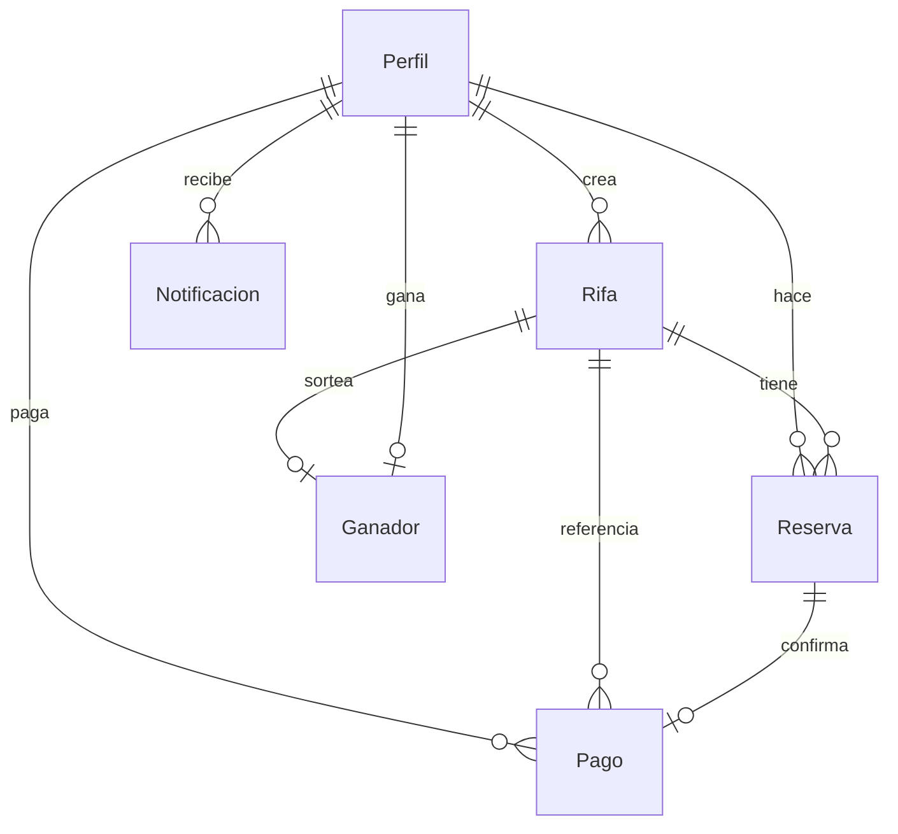

# Modelo de Datos

## Qué es

Modelo relacional Postgres (Supabase) detrás del dominio.

## Estado

Migraciones `0001`–`0003` + seed. UI aún mock. Campos MP en `pagos` = deuda respecto a [[Estrategia de Pagos]].

## Conexiones

- [[Entidad Perfil]] · [[Entidad Rifa]] · [[Entidad Reserva]]
- [[Entidad Pago]] · [[Entidad Ganador]] · [[Entidad Notificacion]]
- [[Supabase]] · [[Clientes Supabase]]

## Archivos

- `lib/types.ts`
- `types/supabase.ts`
- `supabase/migrations/*.sql`
- `supabase/seed.sql`

## Ver también

- [[MOC Dominio]] · [[Home]]
